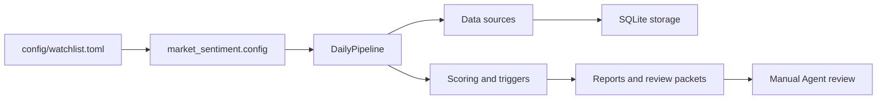

# Architecture

## Top-Level Shape

This project is now organized as one root Agent Skill, with a Python engine embedded inside it.

```text
市场情绪/
  SKILL.md
  agents/
  docs/
  references/
  scripts/
  defaults/
  secrets/
  src/market_sentiment/
  config/
  tests/
  data/
  legacy_skills/
```

## Boundaries

`SKILL.md` is the agent-facing navigation layer. It tells Codex which resource to load for each kind of task.

`src/market_sentiment/` is the runtime engine. It owns CLI parsing, config loading, source clients, pipeline orchestration, scoring, report generation, review packet generation, storage, and preflight checks.

`scripts/` contains standalone deterministic helpers that are useful even when the full CLI is not the right tool.

`references/` contains task manuals that should be loaded only when relevant. This keeps `SKILL.md` readable while preserving detailed workflows.

`docs/` contains design intent and operating context. These files are for project understanding, not every run.

`defaults/` contains portable defaults that can ship with the skill. `config/` remains the local runtime config that the CLI actually uses by default.

`data/` is generated output and cache. It can be inspected for a concrete run, but it is not source code or skill instruction.

`secrets/` is local-only credential storage. It is ignored by git except for placeholder examples and documentation.

`legacy_skills/` preserves the earlier standalone skill folders locally after their core content was merged into the root skill. It is ignored for future Git pushes.

## Runtime Flow



## Key Runtime Modules

- `cli.py`: command entry point for `init-db`, `preflight`, `run-daily`, `show-report`, and `cleanup-data`.
- `pipeline.py`: orchestration layer for benchmarks, securities, macro data, official events, social signals, options, scoring, and outputs.
- `config.py`: TOML plus environment-variable configuration loader.
- `sources/`: SEC, Alpha Vantage, Stooq, FRED, EIA, Reddit, forum, X, and options clients.
- `storage.py`: SQLite schema and persistence.
- `triggers.py`: abnormal move detection.
- `scoring.py`: action state, evidence scoring, red flags, and decision shaping.
- `review_packets.py`: machine-readable packets for later manual or LLM review.
- `manual_agent_report.py`: Chinese manual review report.
- `runtime_preflight.py`: runtime dependency and credential checks.

## What Changed

Previously the repository mixed a Python project with two top-level skill folders:

- `market-sentiment-research`
- `us-smallmid-dislocation`

Those workflows are now integrated into the root skill. Their scripts, defaults, and references have been copied into the root resource folders, and the original folders are retained under `legacy_skills/` for history.
