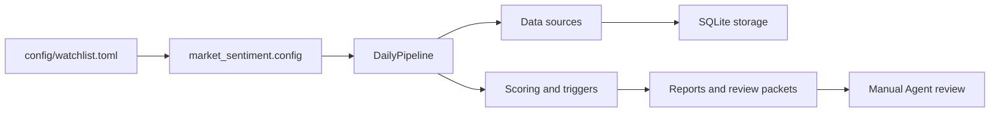

# Architecture

## Top-Level Shape

This project is organized as one Agent Skill plus a shared resource area.

```text
市场情绪/
  skills/
    market-sentiment-research/
  sharing-resources/
    docs/
    references/
    scripts/
    src/market_sentiment/
    tests/
    examples/
    secrets/
  config/
  data/
  pyproject.toml
```

## Boundaries

Each `skills/<name>/SKILL.md` is the agent-facing entry point for one workflow.

`skills/market-sentiment-research/` owns single-name or short-list pullback research, target-pool defaults, price-cache refresh, and `Reject / Watch / Starter / Add / Exit` decisions.

`sharing-resources/src/market_sentiment/` is the runtime engine. It owns CLI parsing, config loading, source clients, pipeline orchestration, scoring, report generation, review packet generation, storage, and preflight checks.

`sharing-resources/scripts/` contains shared deterministic helpers such as JSON redaction.

`sharing-resources/references/` contains project-wide references that both Skills may need, especially configuration, secrets, generated outputs, and runtime commands.

`sharing-resources/docs/` contains project-level design and operating context.

`config/watchlist.toml` remains the local runtime config used by the CLI.

`data/` is generated output and cache. It can be inspected for a concrete run, but it is not source code or skill instruction.

`sharing-resources/secrets/` is local-only credential storage. It is ignored by git except for placeholder examples and documentation.

## Runtime Flow



## Key Runtime Modules

- `cli.py`: command entry point for `init-db`, `preflight`, `run-daily`, `show-report`, and `cleanup-data`.
- `pipeline.py`: orchestration layer for benchmarks, securities, macro data, official events, social signals, options, valuation fundamentals, scoring, and outputs.
- `config.py`: TOML plus environment-variable configuration loader.
- `sources/`: SEC, Alpha Vantage, Stooq, FRED, EIA, Reddit, forum, X, and options clients.
- `storage.py`: SQLite schema and persistence.
- `triggers.py`: abnormal move detection.
- `scoring.py`: action state, evidence scoring, red flags, and decision shaping.
- `valuation.py`: derived valuation inputs (TTM sums, liquid assets, net cash, enterprise value, beta) computed from SEC data — Layer 2 evidence only, no valuation models.
- `review_packets.py`: machine-readable packets for later manual or LLM review.
- `manual_agent_report.py`: Chinese manual review report.
- `runtime_preflight.py`: runtime dependency and credential checks.

## Valuation Data Layer

`sources/sec.py` extracts a richer `ValuationFundamentals` snapshot from the SAME companyfacts
payload already fetched for `FundamentalSnapshot` (one HTTP request per ticker per run date,
cached in `SecClient` so both callers share it). It pulls income-statement, balance-sheet,
cash-flow, and share-count concepts using an ordered multi-tag fallback list per concept (US-GAAP
tag names vary by filer), keeps up to 20 quarters of history per concept with `end`/`filed`
attribution, dedupes amended/duplicate datapoints by newest `filed`, and sums dei
`EntityCommonStockSharesOutstanding` across share classes reported in the same filing (companyfacts
does not expose the class/member dimension, so distinct values under the same accession number are
summed).

`valuation.py` computes derived inputs from that snapshot plus the existing price-bar lanes: TTM
sums (four contiguous standalone quarters, never a single annual tag), total liquid assets, net
cash, enterprise value, market cap (latest close × best-available share count), and an in-house OLS
beta regression against the benchmark's daily returns. Every derived field is a `ProvenancedValue`
carrying its raw inputs and source; a missing input yields `value=None` with a `reason`, never a
silent default, and is also listed in `data_gaps`.

Two distinctions in that list are load-bearing, and both were wrong in the first implementation:

**Liquid assets are not just cash, and strategic stakes are not liquid.** `total_liquid_assets` is
cash plus *current* marketable securities only. Filers tag those securities inconsistently, so the
concept resolves through an ordered fallback list (`AvailableForSaleSecuritiesDebtSecuritiesCurrent`,
`MarketableSecuritiesCurrent`, `ShortTermInvestments`, …) taking the first tag with data — never
summing two tags that could describe the same balance. Long-dated venture and equity-method stakes
(`LongTermInvestments`, `AlternativeInvestment`, `EquityMethodInvestments`) are reported separately
as `non_operating_assets`; they are real value but cannot be realised on demand, so a downstream
model must haircut them rather than treat them as a cash floor. Verified on Zoom (CIK 0001585521,
period ending 2026-04-30): cash $0.891B + current securities $6.830B = $7.721B liquid, matching the
company's own "cash and marketable securities" disclosure, with a further $1.876B of strategic
stakes held out separately. Reading `CashAndCashEquivalentsAtCarryingValue` alone would have
reported $0.891B, understating liquidity by 8.7x.

**Quarters are normalised before any TTM sum.** SEC duration facts mix standalone quarters with
year-to-date cumulatives, and most 10-K filers never report a standalone Q4 at all. Every duration
concept is therefore routed through a normaliser that buckets facts by `end - start` length
(~85–95d quarter, ~175–190d half, ~265–280d three quarters, ~355–375d year) and recovers each
missing standalone quarter by subtracting the next-shorter cumulative *sharing the same `start`*
(`Q2 = H1 − Q1`, `Q3 = 9M − H1`, `Q4 = FY − 9M`). Matching is done on `start`/`end` dates only —
filers' `fy`/`fp` labels are unreliable for this, because comparative-period entries are often
tagged with the filing's fiscal year rather than their own. Each resulting quarter is marked
`reported` or `derived` with a trace of what produced it, and TTM sums only four *contiguous*
standalone quarters; when contiguity cannot be reached the result is `None` with a reason rather
than a plausible-looking sum over a five-quarter span. Verified on Zoom: TTM revenue $4,933.1M
(FY $4,868.8M − Q1FY26 $1,174.7M + Q1FY27 $1,239.0M), with the recovered Q4 of $1,247.0M.

The same normaliser is what makes cash-flow concepts usable at all: operating cash flow, capex,
share-based compensation and D&A are commonly disclosed as "six months ended" / "nine months ended"
cumulatives, which would otherwise collapse the quarterly series to one usable datapoint per year.

Remaining limitations:

1. **Beta is frequently unusable, by nature rather than by bug.** `PipelineContext` carries roughly
   six months of daily price history (Tiger/Yahoo fetch ~150 calendar days / a 6-month chart range,
   on the order of 120-125 daily bars before date-alignment trims them to shared trading dates), and
   that short a daily-return window cannot pin down beta for a stock whose moves are idiosyncratic.
   The regression itself is verified correct (a synthetic series with a true beta of 1.5 is recovered
   as 1.500 at R² 1.0, and date alignment now correctly turns 125 raw bars into 124 paired
   observations), but on real Zoom data over that six-month window it returns beta 0.41 at R² 0.037
   — the benchmark explains under 4% of the variance, because the stock has been trading on
   company-specific news. `BetaEstimate` therefore carries `reliable`, set false when R² < 0.10 or
   observations < 30, with the reason attached. **A model layer must treat the discount rate as an
   explicit assumption with a sensitivity range, not as a computed fact, whenever beta is flagged
   unreliable.**
2. **Lease liabilities under ASC 842 operating leases are not captured in `total_debt`.** Zoom has no
   finance leases at all — its ~$60.2M of lease obligations as of 2026-04-30 (`OperatingLeaseLiabilityCurrent`
   $28.3M + `OperatingLeaseLiabilityNoncurrent` $31.9M) are entirely operating-lease tags, which are
   outside both the `long_term_debt` and `finance_lease_obligations` candidate tag lists (the latter
   exists specifically for filers that *do* report genuine `FinanceLeaseLiability*`/
   `CapitalLeaseObligationsNoncurrent` balances — Zoom just isn't one of them). So for Zoom both
   concepts resolve to no-data, `total_debt` defaults to 0 via `zero_if_missing`, and `net_cash` equals
   gross liquid assets. The gap is listed in `data_gaps` rather than silently zeroed; for filers with
   material operating-lease books this understates leverage more than it does here.

This data layer is Layer 2 advisory evidence only, exposed as `valuation_inputs` in the review
packet alongside `analyst_summary`. It does not enter `bucket_scores`, cannot set
`partial_coverage`, and implements no valuation model (no DCF, no scoring, no ratio verdicts) — a
follow-up model layer consumes it.

## What Changed

The repository previously carried a second Skill, `us-smallmid-dislocation`, for bulk small/mid-cap
screening. It was removed; the project is now a single Skill plus the shared runtime. Its history
remains on the `smallmid-dev` branch.
