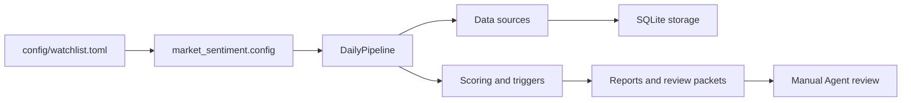

# Architecture

## Top-Level Shape

This project is organized as two sibling Agent Skills plus a shared resource area.

```text
市场情绪/
  skills/
    market-sentiment-research/
    us-smallmid-dislocation/
  sharing-resources/
    docs/
    references/
    scripts/
    src/market_sentiment/
    tests/
    examples/
    secrets/
  config/
  data/
  pyproject.toml
```

## Boundaries

Each `skills/<name>/SKILL.md` is the agent-facing entry point for one workflow. The two Skills should not share action labels or decision rules.

`skills/market-sentiment-research/` owns single-name or short-list pullback research, target-pool defaults, price-cache refresh, and `Reject / Watch / Starter / Add / Exit` decisions.

`skills/us-smallmid-dislocation/` owns prepared-universe candidate screening, small/mid defaults, red flags, thresholds, and `Pass / Watchlist / Investigate` states.

`sharing-resources/src/market_sentiment/` is the runtime engine. It owns CLI parsing, config loading, source clients, pipeline orchestration, scoring, report generation, review packet generation, storage, and preflight checks.

`sharing-resources/scripts/` contains shared deterministic helpers such as JSON redaction.

`sharing-resources/references/` contains project-wide references that both Skills may need, especially configuration, secrets, generated outputs, and runtime commands.

`sharing-resources/docs/` contains project-level design and operating context.

`config/watchlist.toml` remains the local runtime config used by the CLI.

`data/` is generated output and cache. It can be inspected for a concrete run, but it is not source code or skill instruction.

`sharing-resources/secrets/` is local-only credential storage. It is ignored by git except for placeholder examples and documentation.

## Runtime Flow



## Key Runtime Modules

- `cli.py`: command entry point for `init-db`, `preflight`, `run-daily`, `show-report`, and `cleanup-data`.
- `pipeline.py`: orchestration layer for benchmarks, securities, macro data, official events, social signals, options, scoring, and outputs.
- `config.py`: TOML plus environment-variable configuration loader.
- `sources/`: SEC, Alpha Vantage, Stooq, FRED, EIA, Reddit, forum, X, and options clients.
- `storage.py`: SQLite schema and persistence.
- `triggers.py`: abnormal move detection.
- `scoring.py`: action state, evidence scoring, red flags, and decision shaping.
- `review_packets.py`: machine-readable packets for later manual or LLM review.
- `manual_agent_report.py`: Chinese manual review report.
- `runtime_preflight.py`: runtime dependency and credential checks.

## What Changed

The repository briefly merged both workflows into one root Skill. That was too flat because the two workflows have different action vocabularies and resource needs.

The current shape restores the two Skill boundary while keeping shared runtime assets in one place.
